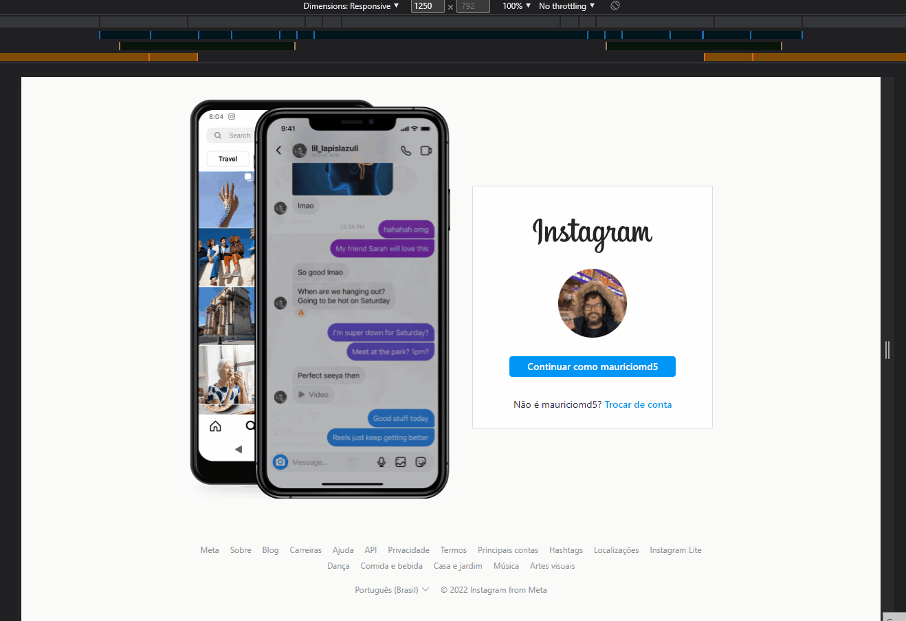

# Instagram Login Clone

## Índice

* [Informação geral](#informação-geral)
* [Tecnologias](#tecnologias)
* [Lista de tarefas](#lista-de-tarefas)

 

## Informação geral

Desafio do curso de HTML & CSS da [DIO](https://www.dio.me/) para recriar a página de login do instagram. Utilizei como gabarito essa versão visitada em 24/04/2022: 

Existem três breakpoints de resolução na página. Na resolução maior, existe um carrossel de screenshots no telefone com quatro imagens.

 	

## Tecnologias

Projeto criado com:

 HTML

 CSS

 Javascript

 

## Lista de tarefas

- [X] HTML
- [ ] CSS
- [ ] Carrossel

<!---
Resultado
-->
